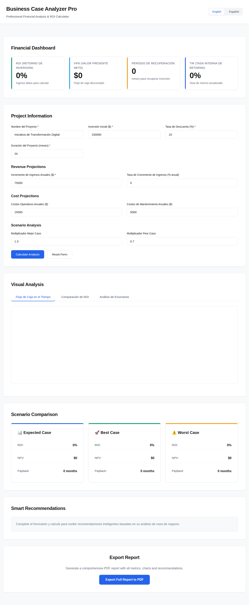
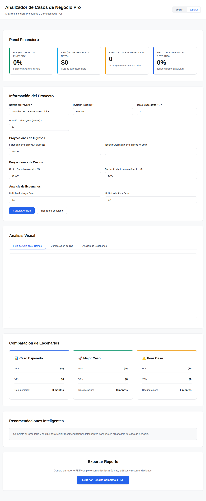
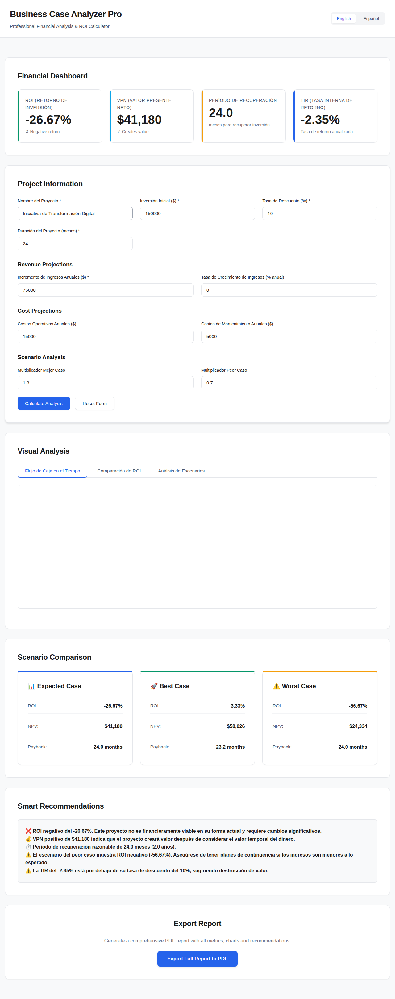

# 💼 Business Case Analyzer Pro / Analizador de Casos de Negocio Pro

A professional-grade financial analysis tool for evaluating business cases with advanced ROI calculations, NPV analysis, and intelligent recommendations.

**🌐 BILINGUAL** - Full English/Spanish interface with professional financial terminology and seamless language switching.

## 📸 Screenshots

### Professional Dashboard - English Version


### Panel Profesional - Versión en Español


### Calculated Results with Smart Recommendations


*Professional corporate design inspired by DEPT Agency and Noomo Agency - clean, minimal, and executive-ready.*

## ✨ Features

### 🎨 Professional Corporate Design
- **Clean & Minimal**: White background with sophisticated gray palette
- **Professional Typography**: Inter font family for clarity and readability
- **Subtle Shadows**: Elegant card designs with professional depth
- **Corporate Colors**: Blue (#2563EB), Green (#059669), and Yellow (#F59E0B) for data visualization
- **Generous Whitespace**: Spacious layout for executive-level presentation
- **Responsive Design**: Optimized for desktop, tablet, and mobile devices
- **Bilingual Interface**: Seamless English/Spanish toggle in the header

### 📊 Panel Financiero / Financial Dashboard
Métricas financieras en tiempo real en tarjetas interactivas con efectos neón:
- **ROI (Retorno de Inversión)**: Porcentaje de retorno sobre la inversión
- **VPN (Valor Presente Neto)**: Análisis de flujo de caja descontado
- **Período de Recuperación**: Tiempo para recuperar la inversión inicial
- **TIR (Tasa Interna de Retorno)**: Tasa de retorno anualizada

### 📝 Entrada de Datos Completa / Comprehensive Data Entry
Formularios completos de entrada de proyecto con validación en español:
- Nombre del proyecto e información básica
- Monto de inversión inicial
- Tasa de descuento para cálculos de VPN
- Duración del proyecto (en meses)
- Proyecciones de ingresos con tasas de crecimiento
- Costos operativos y de mantenimiento
- Multiplicadores de análisis de escenarios (mejor/peor caso)

### 🧮 Cálculos Financieros Avanzados / Advanced Financial Calculations
- **Cálculo de ROI**: Métricas precisas de retorno de inversión
- **Análisis de VPN**: Valor presente neto con tasas de descuento personalizables
- **Período de Recuperación**: Análisis preciso de punto de equilibrio
- **Cálculo de TIR**: Tasa interna de retorno usando el método de Newton-Raphson
- **Proyecciones de Flujo de Caja**: Pronóstico mensual con tasas de crecimiento
- **Análisis de Escenarios**: Mejor caso, caso esperado y peor caso

### 📈 Gráficos Interactivos Vibrantes / Interactive Charts (Chart.js)
Tres tipos de visualización con colores neón y animaciones suaves:
- **Flujo de Caja en el Tiempo**: Gráfico de líneas mostrando flujos mensuales y acumulados
- **Comparación de ROI**: Gráfico de barras comparando ROI entre escenarios
- **Análisis de Escenarios**: Gráfico radar para comparación multidimensional

### 🎯 Comparación de Escenarios / Scenario Comparison
Tarjetas visuales con glassmorphism mostrando métricas para:
- **Caso Esperado**: Resultado más probable
- **Mejor Caso**: Proyección optimista (con multiplicador personalizable)
- **Peor Caso**: Proyección conservadora (con multiplicador personalizable)

### 💡 Motor de Recomendaciones Inteligentes / Smart Recommendations Engine
Análisis inteligente en español proporcionando:
- Evaluación de viabilidad del ROI
- Interpretación del VPN
- Evaluación del período de recuperación
- Análisis de riesgo basado en variabilidad de escenarios
- Comparación TIR vs. tasa de descuento
- Recomendaciones accionables para la toma de decisiones

### 📄 Funcionalidad de Exportación PDF / PDF Export
Genera reportes completos en español incluyendo:
- Resumen de información del proyecto
- Todas las métricas financieras
- Resultados del análisis de escenarios
- Recomendaciones completas
- Formato profesional con números de página
- Nomenclatura automática de archivos con fechas

### ✨ Experiencia de Usuario Mejorada / Enhanced UX
- **Auto-cálculo**: Actualizaciones en tiempo real con datos de ejemplo
- **Estados de Carga**: Spinner animado con efectos neón durante procesamiento
- **Mensajes de Éxito/Error**: Feedback claro en español
- **Validación de Formularios**: Validación del lado del cliente con mensajes útiles
- **Diálogos de Confirmación**: Prevención de pérdida accidental de datos
- **Datos de Ejemplo**: Datos de demostración pre-cargados en español

## 🚀 Getting Started

### Installation
1. Clone the repository:
   ```bash
   git clone https://github.com/JonMK519/Academy_Proyects.git
   cd Academy_Proyects
   ```

2. Open `index.html` in a modern web browser
   - Or serve with a local web server:
   ```bash
   python3 -m http.server 8080
   # Then navigate to http://localhost:8080
   ```

### No Dependencies Required!
The application uses CDN-hosted libraries:
- Chart.js 3.7.1 (for interactive charts)
- jsPDF 2.4.0 (for PDF export)

## 📖 Guía de Uso / Usage Guide

### 1. Ingresar Información del Proyecto / Enter Project Information
Complete el formulario con los detalles de su proyecto:
- **Nombre del Proyecto**: Identifique su caso de negocio
- **Inversión Inicial**: Costo total inicial
- **Tasa de Descuento**: Su tasa de retorno requerida (típicamente 8-15%)
- **Duración del Proyecto**: Plazo en meses

### 2. Agregar Proyecciones de Ingresos / Add Revenue Projections
- **Incremento de Ingresos Anuales**: Ganancia de ingresos anual esperada
- **Tasa de Crecimiento de Ingresos**: Porcentaje de aumento anual (opcional)

### 3. Especificar Costos / Specify Costs
- **Costos Operativos**: Gastos operacionales anuales
- **Costos de Mantenimiento**: Gastos de mantenimiento anuales

### 4. Configurar Análisis de Escenarios / Configure Scenario Analysis
- **Multiplicador Mejor Caso**: Factor optimista (predeterminado: 1.3 = 30% mejor)
- **Multiplicador Peor Caso**: Factor conservador (predeterminado: 0.7 = 30% peor)

### 5. Calcular y Analizar / Calculate & Analyze
Haga clic en "Calcular Análisis" para ver:
- Métricas financieras en tiempo real con efectos vibrantes
- Gráficos interactivos con colores neón
- Comparaciones de escenarios con glassmorphism
- Recomendaciones inteligentes en español

### 6. Exportar Resultados / Export Results
Haga clic en "Exportar Reporte Completo a PDF" para descargar un reporte de análisis completo en español.

## 🎯 Métricas Clave Explicadas / Key Metrics Explained

### ROI (Retorno de Inversión / Return on Investment)
```
ROI = (Retorno Total - Inversión Inicial) / Inversión Inicial × 100%
```
Un ROI positivo indica una inversión rentable.

### VPN (Valor Presente Neto / Net Present Value)
```
VPN = Σ (Flujo de Caja_t / (1 + Tasa de Descuento)^t)
```
Un VPN positivo significa que el proyecto crea valor.

### Período de Recuperación / Payback Period
Tiempo requerido para recuperar la inversión inicial a través de los flujos de caja.

### TIR (Tasa Interna de Retorno / Internal Rate of Return)
La tasa de descuento que hace que VPN = 0. Compare con su tasa de retorno requerida.

## 🔧 Technical Stack / Stack Técnico

- **HTML5**: Semantic markup with bilingual support
- **CSS3**: Professional styling with Inter font, subtle shadows, and clean layouts
- **Vanilla JavaScript**: No framework dependencies, pure ES6+
- **Chart.js**: Interactive data visualization with corporate color schemes
- **jsPDF**: Client-side PDF generation in both languages

## 📱 Browser Compatibility / Compatibilidad de Navegadores

- ✅ Chrome/Edge (latest version)
- ✅ Firefox (latest version)
- ✅ Safari (latest version)
- ✅ Mobile browsers (iOS Safari, Chrome Mobile)

## 🎨 Design Philosophy / Filosofía de Diseño

**Professional Corporate Design - Inspired by DEPT Agency & Noomo Agency:**

- **🎯 Minimal & Clean**: Whitespace-driven layout for executive-level presentation
- **💼 Corporate Colors**: Professional palette (Blue #2563EB, Green #059669, Yellow #F59E0B)
- **📐 Professional Typography**: Inter font family with clear hierarchy
- **🎨 Subtle Elegance**: Soft shadows and refined borders, no excessive effects
- **🌐 Bilingual Excellence**: Seamless English/Spanish switching
- **📊 Data-Focused**: Clear visualization with professional chart colors
- **📱 Fully Responsive**: Perfect adaptation to all screen sizes
- **⚡ Fast & Efficient**: No unnecessary animations or effects

## 📊 Cálculo de Ejemplo / Sample Calculation

**Proyecto de Ejemplo:**
- Inversión Inicial: $150,000
- Ingresos Anuales: $75,000
- Costos Operativos: $15,000/año
- Mantenimiento: $5,000/año
- Duración: 24 meses
- Tasa de Descuento: 10%

**Resultados:**
- Ingreso Mensual Neto: ~$4,583
- Ingreso Total (2 años): $110,000
- ROI: -26.67% (necesita mejora)
- VPN: $41,180 (genera valor)
- Recuperación: 24 meses

## 🤝 Contributing

Contributions are welcome! Please feel free to submit issues or pull requests.

## 📄 License

This project is open source and available for educational and commercial use.

## 👨‍💻 Author

Created as part of the Academy Projects collection.

---

**Note**: This is a fully functional professional tool, not just a demo. All financial calculations are accurate and follow standard financial analysis methodologies.